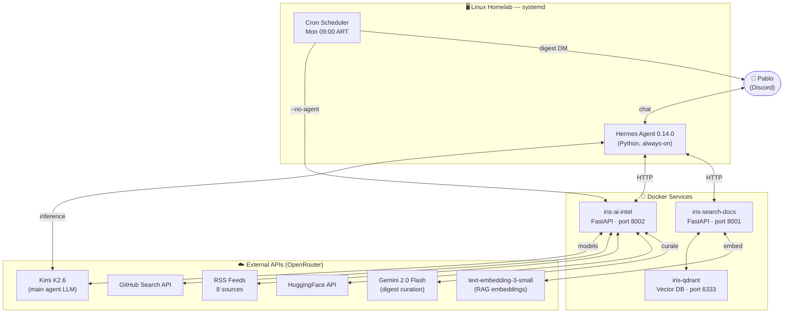

# 🤖 Iris — Personal AI Assistant

A 24/7 AI assistant running on a personal Linux homelab, accessible via Discord.
Built as a portfolio project to demonstrate end-to-end AI engineering skills.

> **Ask Iris:** *"What dropped in AI this week?" · "Search my notes on RAG" · "What's trending on GitHub?"*
> Every Monday at 9 AM she sends a curated AI newsletter — unprompted.

---

## Features

| Feature | Description |
|---|---|
| 💬 **Discord interface** | Natural language chat, always-on via systemd service |
| 🔍 **RAG over personal docs** | Ingest any text, search semantically — Qdrant + OpenAI embeddings |
| 📡 **AI news tracker** | Live data: new LLM releases, trending GitHub repos, 8 RSS feeds |
| 📬 **Weekly digest** | Automated Monday newsletter, curated by an LLM — zero user input needed |
| 🌐 **Web search** | DuckDuckGo fallback for queries outside static knowledge |

---

## Architecture



### Data flow — on-demand query

1. Pablo sends a message in Discord
2. Hermes routes it to Kimi K2.6 (via OpenRouter)
3. Kimi decides which tools to call — `search_my_docs`, `ai_intel`, or `web_search`
4. The relevant Docker service returns structured data
5. Kimi formats the response and Hermes delivers it to Discord

### Data flow — weekly digest (push mode)

1. Hermes cron fires Monday 09:00 ART (`0 12 * * 1` UTC)
2. Shell script calls `/digest-smart` on `iris-ai-intel`
3. Service fetches all sources in parallel (APIs + RSS)
4. Gemini 2.0 Flash reads the full week's feed and selects the top items, adding a "why it matters" line per item
5. Formatted Discord message is delivered directly — **no LLM in the delivery path** (`--no-agent`)

---

## Tech Stack

| Layer | Technology |
|---|---|
| **Agent framework** | [Hermes Agent 0.14.0](https://github.com/NousResearch/hermes) (Nous Research) |
| **Main LLM** | Kimi K2.6 (`moonshotai/kimi-k2.6`) via OpenRouter |
| **Digest curator** | Gemini 2.0 Flash (`google/gemini-2.0-flash-001`) via OpenRouter |
| **Embeddings** | `openai/text-embedding-3-small` via OpenRouter |
| **Vector DB** | Qdrant 1.18.1 |
| **Skills backend** | FastAPI + Pydantic v2 + uvicorn |
| **Runtime** | Python 3.11 |
| **Infrastructure** | Docker Compose, systemd user service |
| **Messaging** | Discord (bot: Iris#4138) |
| **Networking** | Tailscale VPN + SSH (ed25519) |
| **OS** | Linux Mint homelab |

---

## Skills (Microservices)

### `ai_intel` — AI News Tracker (`skills/ai_intel/`)

FastAPI service that aggregates the week's AI landscape into structured data.

| Endpoint | Source | Description |
|---|---|---|
| `GET /models` | OpenRouter API + HuggingFace API | New model releases with pricing |
| `GET /repos` | GitHub Search API (3 topics, deduped) | Trending AI repositories |
| `GET /news` | 8 RSS feeds | Posts from OpenAI, DeepMind, HuggingFace, TLDR AI, Simon Willison, Interconnects, Ahead of AI, Google AI |
| `GET /courses` | 5 RSS feeds | New courses from NVIDIA DLI, Coursera, fast.ai, Google Dev, AWS ML |
| `GET /summary` | All of the above | Combined response — used by the Hermes plugin |
| `GET /digest` | All of the above | Pre-formatted Discord message (deterministic, no LLM) |
| `GET /digest-smart` | All + Gemini Flash | LLM-curated digest with relevance context per item |

**Key design decisions:**
- `awesome-*` repos filtered by regex to avoid noise (e.g. `awesome-architecture`)
- News fetched per-source with individual rate limits — Simon Willison capped at 3/week (posts daily)
- DeepLearning.AI has no RSS → routed to `web_search` via agent instructions in SOUL.md
- Gemini Flash used for curation (not Kimi K2.6) — reasoning models spend 2000+ tokens "thinking" on simple formatting tasks

### `search_my_docs` — RAG Skill (`skills/search_my_docs/`)

Personal knowledge base with semantic search.

| Endpoint | Description |
|---|---|
| `POST /ingest` | Chunk text → embed → upsert into Qdrant |
| `POST /search` | Embed query → cosine similarity search → return top-k chunks |
| `GET /collections` | List all Qdrant collections with point counts |

Chunking: word-based with configurable size and overlap. Embedding model: `text-embedding-3-small` (1536d).

---

## Project Structure

```
iris/
├── skills/
│   ├── ai_intel/              # AI news tracker microservice
│   │   ├── main.py            # FastAPI app + all endpoints
│   │   ├── digest.py          # Deterministic Discord formatter
│   │   ├── smart_digest.py    # Gemini Flash curation layer
│   │   ├── sources/           # Data fetchers (OpenRouter, HF, GitHub, RSS)
│   │   ├── models/schemas.py  # Pydantic models
│   │   └── scripts/ai_digest.sh  # Hermes cron script
│   └── search_my_docs/        # RAG microservice
│       └── main.py            # FastAPI app (search + ingest)
├── docker-compose.yml         # Orchestrates all Docker services
├── decisions/                 # Architecture Decision Records (ADRs)
└── notes/                     # Session handoff notes
```

---

## Development Approach

This project was built **phase by phase** over multiple sessions using Claude Code (AI-assisted development). Each phase has an ADR documenting architectural decisions and a handoff note preserving context between sessions.

Key ADRs:
- [ADR 005](decisions/005-openclaw-openrouter-kimi.md) — Switching from local inference to OpenRouter
- [ADR 006](decisions/006-migracion-hermes-discord.md) — Hermes Agent migration
- [ADR 007](decisions/007-push-mode-cron-digest.md) — Push mode: `--no-agent` cron vs. agent-driven delivery

---

## What I Learned

- **Infrastructure**: Deployed a multi-service stack on a personal homelab (Docker Compose, systemd, Tailscale VPN, reverse proxy)
- **RAG pipeline**: Built a complete RAG system from scratch — chunking, embedding, vector storage, semantic retrieval
- **Agent tool design**: Designed FastAPI microservices as agent tools — schema design affects how well the LLM uses them
- **Multi-model orchestration**: Different models for different tasks — reasoning models (Kimi K2.6) for complex conversations, fast instruction models (Gemini Flash) for formatting tasks
- **Push vs. Pull**: Designed both interaction modes — on-demand queries and scheduled autonomous delivery

---

*Built by [Pablo](https://github.com/pabloler21) · Buenos Aires · 2026*
