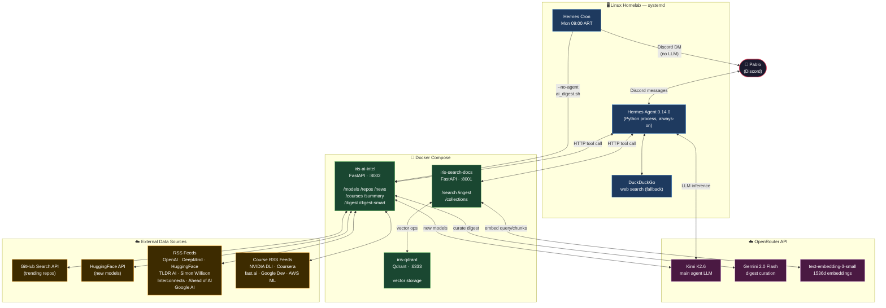

# Iris — Architecture Reference

## System Diagram (Mermaid)



---

## Component Responsibilities

| Component | Responsibility | Location |
|---|---|---|
| **Hermes Agent** | Orchestrates conversations, routes to tools, manages sessions | Host (systemd) |
| **Kimi K2.6** | Main LLM — complex reasoning, tool selection, response formatting | OpenRouter cloud |
| **Gemini 2.0 Flash** | Weekly digest curation — selects top items, adds context per item | OpenRouter cloud |
| **iris-ai-intel** | Fetches and structures AI industry data (models, repos, news, courses) | Docker :8002 |
| **iris-search-docs** | RAG service — chunk, embed, store, retrieve personal documents | Docker :8001 |
| **iris-qdrant** | Vector database for semantic search | Docker :6333 |
| **Hermes Cron** | Schedules weekly digest delivery without agent involvement | Host (embedded in gateway) |

---

## Key Flows

### Flow A — On-demand query
```
User (Discord)
  → Hermes (routes to LLM)
    → Kimi K2.6 (decides: tool call or direct answer)
      → iris-ai-intel OR iris-search-docs OR DuckDuckGo
        ← structured data
      ← formatted response
  ← Discord message
```

### Flow B — Weekly digest (Push mode, Mondays 09:00 ART)
```
Hermes Cron
  → ai_digest.sh (shell script, no LLM)
    → iris-ai-intel /digest-smart
      → [parallel] OpenRouter API + HuggingFace API + GitHub API + RSS feeds
      → Gemini 2.0 Flash (curates: selects top items + adds "why it matters")
      ← Discord-ready text (<1900 chars)
    ← stdout
  → Discord DM (direct delivery, bypasses Hermes agent)
```

---

## Port Map

| Port | Service | Notes |
|---|---|---|
| 6333 | iris-qdrant | REST API + web dashboard |
| 6334 | iris-qdrant | gRPC (high-performance clients) |
| 8001 | iris-search-docs | RAG skill |
| 8002 | iris-ai-intel | AI news tracker |

All ports are internal (localhost). No public exposure — access via Tailscale VPN.

---

## Network Topology

```
Internet
    │
    │ (no direct exposure)
    │
Linux Mint Homelab ────── Tailscale VPN ────── Dev machine (Windows/WSL2)
    │                     100.109.56.91              SSH alias: clawnest-homelab
    │
    ├── Hermes Agent (host)
    ├── Docker network (iris_default)
    │       ├── iris-ai-intel
    │       ├── iris-search-docs
    │       └── iris-qdrant
    └── OpenRouter API (HTTPS, outbound only)
```

---

## Model Selection Rationale

| Task | Model | Why |
|---|---|---|
| Main agent LLM | Kimi K2.6 | Follows complex routing instructions correctly; DeepSeek V4 Flash hallucinated tool outputs |
| Digest curation | Gemini 2.0 Flash | No reasoning overhead (~5s response); Kimi K2.6 spends 2000+ tokens "thinking" on simple formatting tasks |
| Embeddings | text-embedding-3-small | OpenAI-compatible API via OpenRouter; 1536d cosine similarity |

*Principle: right model for the right task — reasoning models are expensive for deterministic formatting.*
